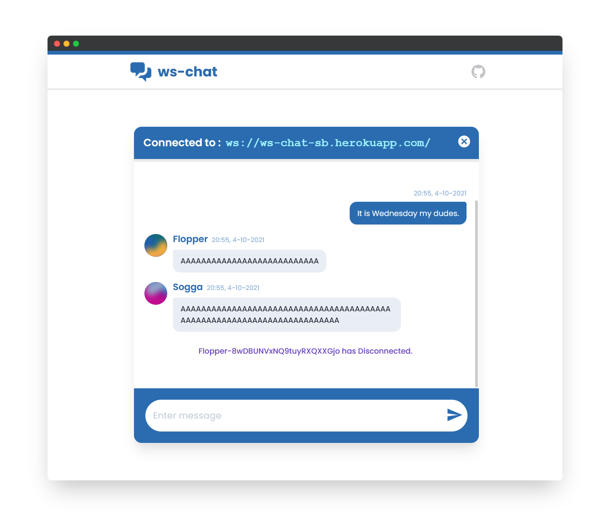

# ws-react
A Chat Application which uses WebSockets to communicate. Uses [ws-server](https://github.com/ShreeyansB/ws-server) as the WebSocket server for communication. 

---


## Features
* Basic message passing
* Multiple Users per IP
* Can use Locally Hosted Server

## Usage
```bash
git clone https://github.com/ShreeyansB/ws-react
cd ws-react
npm start
```
#### To use your own server
```bash
git clone https://github.com/ShreeyansB/ws-server
```
Host the server using Heroku or something else.
Create `.env` file in root of React App. Set environment variable `REACT_APP_WS_URL` to your hosted server URL.
```
REACT_APP_WS_URL="ws://yourwebsocketserver.app/"
```